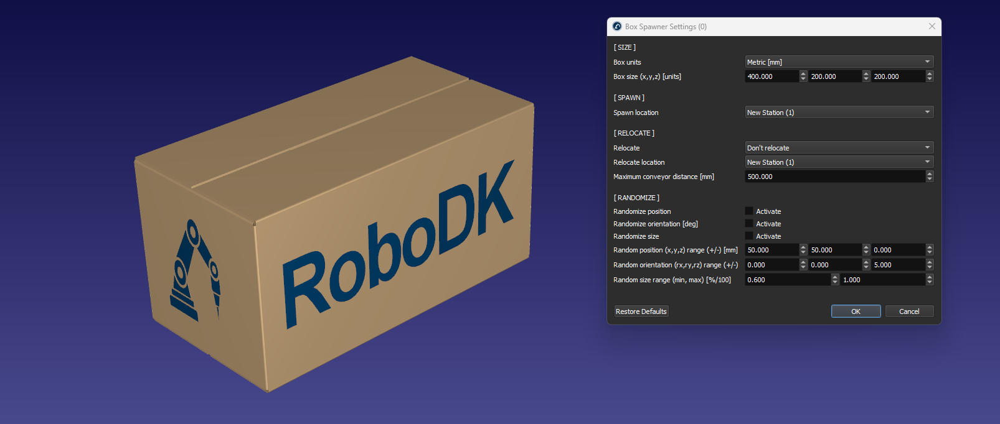

# Box Spawner

The Box Spawner App for RoboDK lets you programmatically add box objects in your RoboDK Station.
You can customize the spawner location, box parameters, and request a new box from a RoboDK Program.
Multiple spawner location are supported by providing a spawner ID in your program call.

- For more information about RoboDK Apps, visit the
[documentation](https://robodk.com/doc/en/PythonAPI/app.html).
- Submit bug reports and feature suggestions on our
[GitHub](https://github.com/RoboDK/Plug-In-Interface/issues).

## Features

### Editor

Use the Editor to set the spawner settings.

- Units: mm or in
- Box size L/W/H in the above units (or X/Y/Z)
- Spawn location: RoboDK item (frame or station) where the box will be spawn
- Conveyor relocation: automatically transfer the box to the closest conveyor
- Randomization: randomize the position, orientation and scale of the box

### Spawner

Use the spawner button to create a new box in you station using the Editor parameters.
The spawner button defaults to the spawner ID #0.

### Add Python Script

Add a python script in your station that will spawn a box when called. Useful for spawning boxes in a Program.
For example, the Program call `Call SpawnBox(2)` will use the spawner ID #2.
