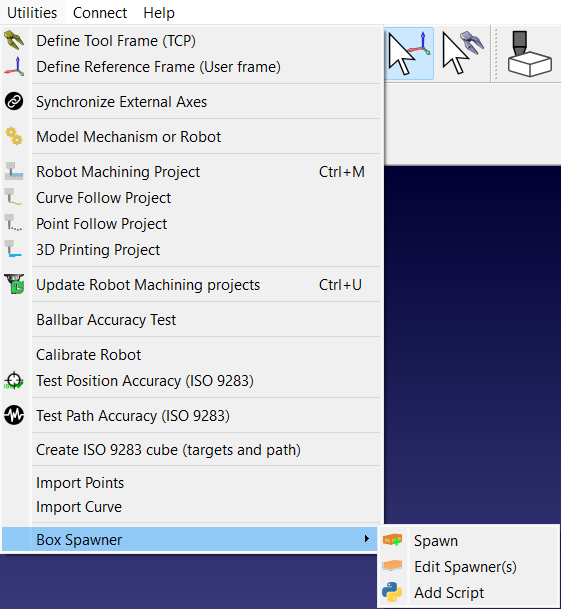
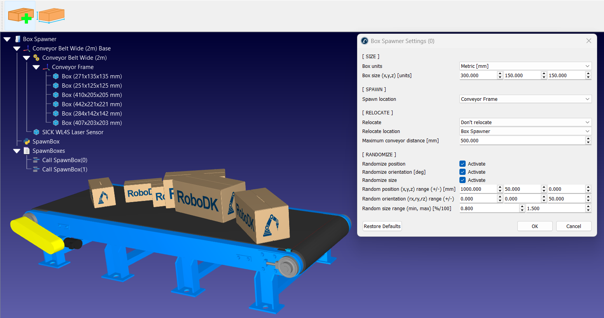

# Box Spawner

The Box Spawner Add-in for RoboDK allows you to programmatically add box objects in your RoboDK station.

It automates the creation, scaling, placement, and conveyor attachment of box components, making it ideal for simulating pick-and-place, palletizing, or conveyor-fed applications.

- For more information about RoboDK Add-ins, visit the
[documentation](https://robodk.com/doc/en/PythonAPI/app.html).
- Submit bug reports and feature suggestions on our
[GitHub](https://github.com/RoboDK/Plug-In-Interface/issues).

## Features

- **Editor Interface:** Configure dimensions, frames, conveyor attachments, and randomization noise.
- **Automated Box Generation:** Generate 3D boxes dynamically with custom dimensions and automatic labeling.
- **Custom Spawn Locations:** Spawn items directly relative to any RoboDK item (reference frame or station base).
- **Conveyor Relocation:** Automatically detect and attach spawned boxes to the closest moving conveyor mechanism or a specific frame.
- **Randomization Control:** Add position offsets, rotational noise, and scale variations to simulate real-world variability.
- **Multi-Spawner Profiles:** Configure and maintain multiple spawner profiles using Spawner IDs.
- **Programmatic Execution:** Trigger spawning manually via the toolbar or programmatically within RoboDK programs.

## Usage

### Spawner

Click the **Spawn** icon in the toolbar to spawn a box instantly using the active profile (defaults to Spawner ID #0).

You can also navigate to **Utilities - Box Spawner - Spawn** to generate a box.

### Editor

Use the Editor to set the spawner settings.

- Units: In millimeters or inches.
- Box Size: L/W/H (or X/Y/Z) in the above units.
- Spawn Location: RoboDK item (frame or station) where the box will be spawned.
- Conveyor Relocation: Automatically transfer the box to the closest conveyor.
- Randomization: Randomize the position, orientation, and scale of the box.

### Add Python Script

Add a python script in your station (by going to Utilities - Box Spawner - Add Script) that will spawn a box when called. Useful for spawning boxes when a RoboDK program is running.

For example, the program call `Call SpawnBox(1)` will use the Spawner ID #1 and spawn the box according to **Box Spawner Settings (1)**.
