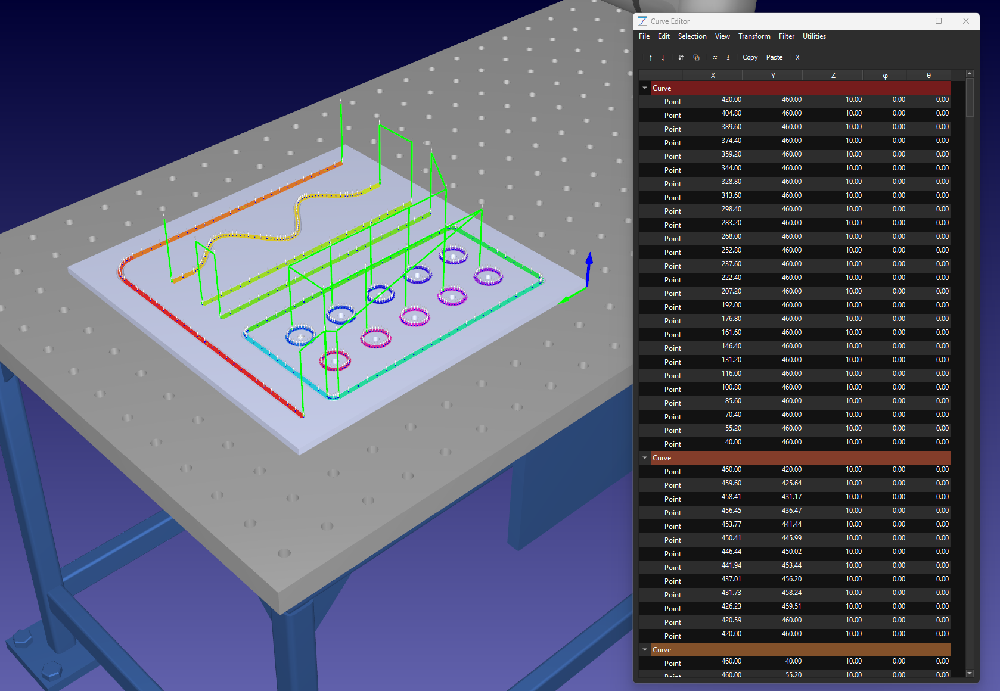

# Curve Utilities

The Curve Utilities App for RoboDK adds tools to edit, import and export curves and points.

You can open the curve editor by going to **Utilities - Curve Utilities - Open Curve Editor** or by simply clicking its corresponding icon in the toolbar.

## Features

**Comprehensive Curve Editing**

- Graphical Interface: Edit curves and points using a user-friendly table view.
- 3D Visualization: View the current selection in the 3D environment.
- Distance Calculations: Find point-to-point and cumulative distances (travel length).

**Point and Curve Management**

- Operations: Add, remove, and edit points; set point normals using polar coordinates; duplicate curves - and points quickly.
- Curve Conversion: Convert curves to singular points and vice versa; convert robot programs to curves.
- Reordering and Orientation: Reorder curves and points, reverse the order of curves, and flip normals/- orientation vectors.
- Merge and Split: Merge curve segments into a single curve or split discontinuous curves into separate - objects.
- Surface Projection: Project curve points onto any object surface and recalculate normals.
- Simplification and Sorting: Automatically simplify curves, remove duplicate points, sort curves for - continuous paths, and remove points along straight lines.
- Dynamic Offsets: Apply relative, normal, and tangent offsets dynamically.
- Bulk Editing: Edit multiple points simultaneously for efficiency.

**Import/Export Functionality**

- CSV and SVG Files: Import and export curves and points from CSV files; import curves from SVG (.svg) files for added versatility.

**Note:** Curve colors are not supported and will be lost.