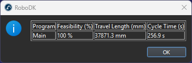
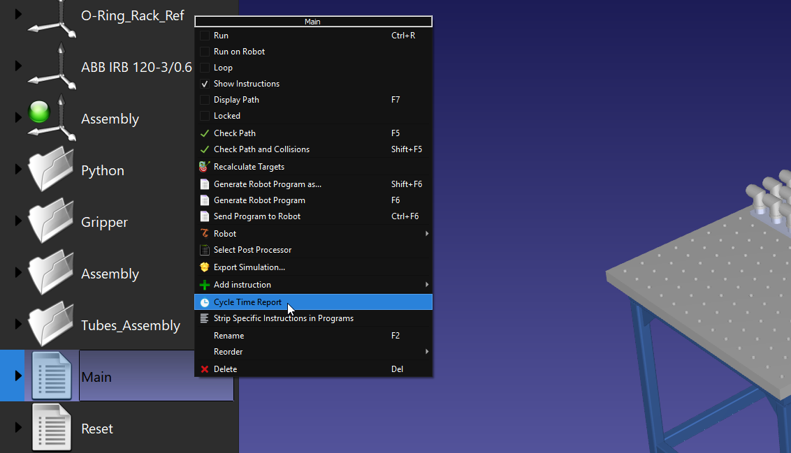

# Cycle Time

The Cycle Time App for RoboDK is a toolbox for cycle time estimation of robot programs.
Retrieve valuable metrics from your robot programs, such as feasibility, travel length (mm) and travel time (seconds).
Perform time study by comparing performance with different robot speed.

## Features

- Generate cycle time estimates for multiple programs
- Save cycle time estimates to .CSV files

