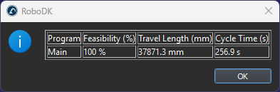
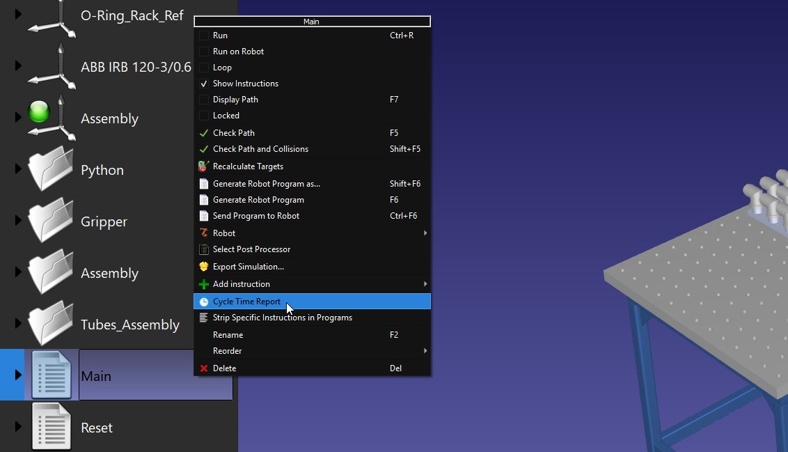

# Cycle Time

The Cycle Time Add-in for RoboDK is a toolbox for cycle time estimation of robot programs.

Retrieve valuable metrics from your robot programs, such as feasibility, travel length (mm) and travel time (seconds).

Perform a time study by comparing performance with different robot speeds.

## Features

- Generate cycle time estimates for multiple programs
- Save cycle time estimates to .CSV files

