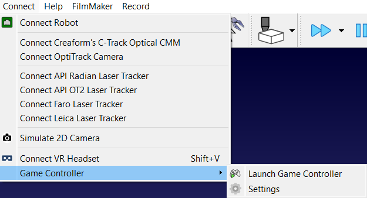
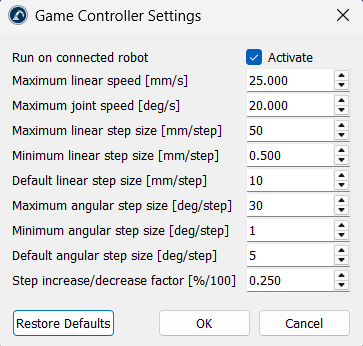

# Game Controller

The Game Controller App for RoboDK allows you to control your robot arm using a game controller.

- For more information about RoboDK Apps, visit the
[documentation](https://robodk.com/doc/en/PythonAPI/app.html).
- Submit bug reports and feature suggestions on our
[GitHub](https://github.com/RoboDK/Plug-In-Interface/issues).

## Features

- Supports multiple controllers
- Jog your robot using [RoboDK Drivers](https://robodk.com/doc/en/Robot-Drivers.html#RobotDrivers)

## Usage

Press the Controller icon in the toolbar to start the app, and click again to stop it. You can also navigate to Connect-Game Controller-Launch Game Controller to start the app.

Status updates will be available on the status bar of RoboDK (bottom of the screen).

By default, this app moves the simulated robot. You can also move the real robot if you are connected using the RoboDK driver for your robot controller:

- Select Connect-Connect Robot
- Enter the IP of the robot
- Select Connect

Some robot controllers will require you to follow additional steps on the robot side. More information about RoboDK drivers here:

- <https://robodk.com/doc/en/Robot-Drivers.html#UseDriver>

### Controller mapping

The default mapping was created for an Xbox One controller.

- Press and hold X (X axis), Y (Y axis) or B (Z axis) to select an axis.
- Use the D-pad up or down to move the robot along the selected axis.
- Use the D-pad left or right to decrease/increase the steps.
- Press the left joystick (LSB) to toggle between translation (default) and rotation.
- Press the right joystick (RSB) to toggle between MoveJ (default) and MoveL.
- Press both bumpers (LB + RB) to Home.
- **Use the right trigger (RT) to engage the safeguard and enable movements.**

### Settings

You can edit the settings to suit your needs, such as robot speeds, step size, step range, initial settings, etc.

