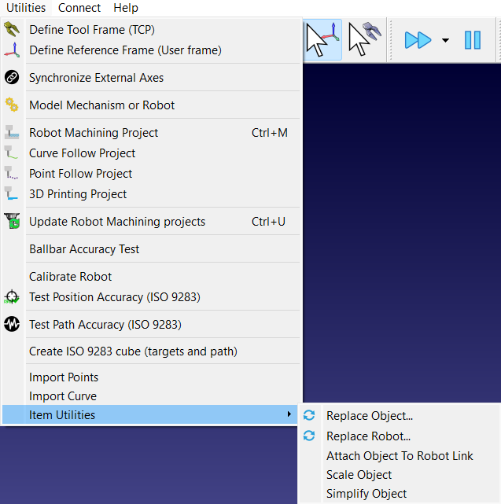

# Item Utilities

The Item Utilities Add-in for RoboDK adds utility functions to manipulate items such as objects and robots directly in your RoboDK station.
You can access its features directly from the menu bar by navigating to **Utilities - Item Utilities**, or by right-clicking any item in the station or station tree and selecting **Item Utilities**.

- For more information about RoboDK Add-ins, visit the
[documentation](https://robodk.com/doc/en/PythonAPI/app.html).
- Submit bug reports and feature suggestions on our
[GitHub](https://github.com/RoboDK/Plug-In-Interface/issues).

## Features

- **Replace Object:** Swap an existing station object with a new 3D model while preserving its exact physical location.
- **Replace Robot:** Change robot models while maintaining existing program/target links, base offsets, and attached tools.
- **Attach Object To Robot Link:** Permanently lock objects (e.g., dress packs, harnesses, custom fixtures) onto specific robot joints/links.
- **Scale Object:** Uniformly or non-uniformly resize objects and curves along the X, Y, and Z axes.
- **Simplify Object:** Clean up dense meshes by removing redundant triangles and small geometry to enhance simulation performance.
