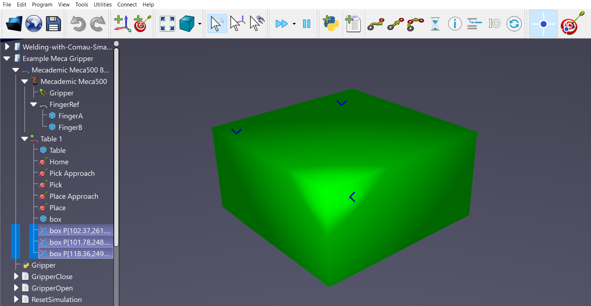

# Point Utilities

The Point Utilities App for RoboDK adds tools to generate and edit point objects.

- For more information about RoboDK Apps, visit the
[documentation](https://robodk.com/doc/en/PythonAPI/app.html).
- Submit bug reports and feature suggestions on our
[GitHub](https://github.com/RoboDK/Plug-In-Interface/issues).

## Features

**Add Point(s) On Surface:** Click on any object's surface mesh to place points continuously while the action is active. It automatically reads the physical mouse contact point to calculate local positional coordinates and geometric surface normal vectors.This feature supports adding new point structures directly to the selected object or outputting them as standalone named target items.

**Convert Point(s) To Target(s):** Transforms point positions into real robot targets using the local normal vector to align the tool Z-axis approach. This also includes a toggle setting to invert point normal paths to ensure proper entry approach direction for robot kinematics. It sorts the index order of point lists based on distance to ensure the robot moves smoothly between neighboring points without erratic jumps.
