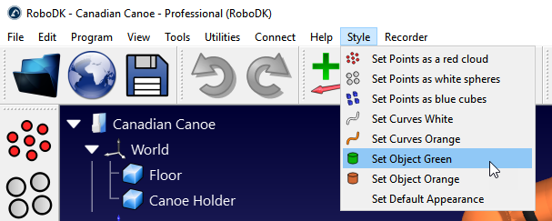
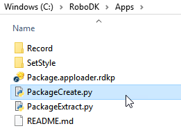

# Example Add-ins

This folder contains ready-to-load example RoboDK Add-ins. Each subfolder is a self-contained Add-in that the App Loader plugin (or the Add-in Manager) turns into a menu and a toolbar — see the [App Loader plugin README](../README.md) for how the plugin itself works and how to load it. These Add-ins work as classic apps (.ini files), or as regular Add-ins for the Add-in Manager.

**Note:** The App Loader plugin is an open source version of the Add-in Manager. You should use the new Add-in Manager to load, create or edit existing Add-ins. You can still use the App Loader plug-in to load classic (legacy) Add-ins: <https://robodk.com/doc/en/Add-ins.html#Addins>.

## Available examples

| Add-in | Description |
|--------|-------------|
| [AppTemplate](./AppTemplate/README.md) | Template with the necessary examples to build your own RoboDK App. Start here for a new Add-in. |
| [BoxSpawner](./BoxSpawner) | Programmatically add box objects to your RoboDK station. |
| [CurveUtilities](./CurveUtilities) | Tools to generate and edit curve objects. |
| [CycleTime](./CycleTime) | Toolbox for cycle time estimation of robot programs. |
| [GameController](./GameController) | Control your robot arm using a game controller. |
| [ItemUtilities](./ItemUtilities) | Utility functions to manipulate Items, such as objects and robots. |
| [ObjectDeleter](./ObjectDeleter) | Customizable zones that delete objects. |
| [PointUtilities](./PointUtilities) | Tools to generate and edit point objects. |
| [ProgUtilities](./ProgUtilities) | Tools to edit programs and program instructions. |
| [Reachability](./Reachability) | Preview reachable tool poses from the current position. |
| [Record](./Record) | Cinematic recording capabilities. |
| [SetStyle](./SetStyle) | Quick appearance presets for curves, points and objects. |
| [SettingsImportExport](./SettingsImportExport) | Export and import RoboDK settings as an INI file. |
| [Snapshot](./Snapshot) | High resolution snapshot (print screen) capabilities. |
| [Sound](./Sound) | Programmable sound effects and background music/noise. |
| [SurfacePatternGenerator](./SurfacePatternGenerator) | Generate simple surface patterns on an object surface. |
| [ViewManager](./ViewManager) | 3D view and interface presets. |
| [ViewUtilities](./ViewUtilities) | Bulk visibility functions (visible/hidden). |

For a detailed, documented example/template of a RoboDK Add-in, see [AppTemplate](./AppTemplate/README.md) — it is the best starting point for building your own.

## Running an example

- Select Tools -> Plug-Ins
- Select Load Plug-Ins
- Select AppLoader


Each Add-in gets its own entry in the main menu and its own toolbar, and each script inside an Add-in becomes a button in both. For example, the `Record` and `SetStyle` folders shown below produce two menus and two toolbars:

```bash
C:/RoboDK/
│
├───Apps
│   │
│   ├───Record
│   │       AppConfig.ini
│   │       AttachCamera.py
│   │       AttachCamera.svg
│   │       AttachCameraChecked.svg
│   │       Record.py
│   │       Record.svg
│   │       RecordChecked.svg
│   │       SetSize.py
│   │       SetSize.svg
│   │
│   ├───SetStyle
│   │      AppConfig.ini
│   │      Points_Default.py
│   │      Points_PointCloud.py
│   │      Points_PointCloud.svg
│   │      Points_Cubes.py
│   │      Points_Cubes.svg
│   │      Points_Spheres.py
│   │      Points_Spheres.svg
│   │      Curves_Orange.py
│   │      Curves_Orange.svg
│   │      Curves_White.py
│   │      Curves_White.svg
│   │      Surfaces_Green.py
│   │      Surfaces_Green.svg
│   │      Surfaces_Orange.py
│   │      Surfaces_Orange.svg
│   │      Settings.py
│   │      Settings.svg
│   │
│   ...
│
├───bin
...

```



## Add-in format

Each Add-in is a subfolder inside `/RoboDK/Apps/`. You can add or remove Add-ins by adding or deleting folders, and add or remove actions/buttons by adding or removing Python (or executable) scripts inside a folder. Scripts that start with an underscore (`_`) are ignored and can be used as shared modules.

You can also use executable files (EXE) instead of PY files.

### Icons

Having an image with the same name as the script will automatically load the image as the action's icon. Supported image types include SVG, PNG, JPG and ICO (in this order of preference).

### AppConfig.ini

An `AppConfig.ini` is auto-generated the first time a new Add-in folder is found (if one doesn't already exist). It customizes the priority of the Add-in, the size of the toolbar, and the size and look of each action.

The top `[General]` section controls the Add-in itself. For example, the Record Add-in's settings look like this:

```ini
[General]
MenuName=Recorder   # Name displayed in the main menu
MenuParent=         # Name of the parent menu, if not using the main menu. For instance, menu-Utilities, menu-Program, menu-Tools, etc.
MenuPriority=999    # Lower shows first compared to other apps
MenuVisible=true    # Set to false to hide the menu from the parent menu
Version=1.0.0       # Version of the application
ToolbarArea=2       # Location in the toolbar, it can be: left (1), right (2), top (4), bottom (8) or default (-1)
ToolbarSizeRatio=2  # Size of the toolbar as a ratio with respect to the default size (2 means twice the size of the default size)
RunCommands=        # String with commands to execute when the toolbar is loaded
```

Each action also has its own section. For example, the Record action (`Record.py`) looks like this:

```ini
[Record]
DisplayName=Record                  # Name displayed in the app menu
Description=Start/stop recording    # Description to display on hover
Visible=true                        # Set to false to disable this action (not show it)
DeveloperOnly=false                 # Set to true to make this action enabled in Developer Mode only
Shortcut=                           # Set a keyboard shortcut to trigger this action, Ctrl+M for instance
Checkable=true                      # Set to true if we want this to be checkable
CheckableGroup=1                    # Set to a number greater than zero if you want to group this action with other actions having the same group index
AddToMenu=true                      # Set to false to not show this action in the main menu
AddToToolbar=true                   # Set to false to not show this action in the toolbar
Priority=1                          # Set the priority within the same app (lower shows first)
TypeOnContextMenu=                  # Set to an item type to display this action when right clicking on the item (same index as the ITEM_TYPE_* in the API). -1 means any type, and you can use commas to specify multiple items
TypeOnDoubleClick=                  # Set to an item type to run this action when double clicking on the item (same index as the ITEM_TYPE_* in the API). -1 means any type, and you can use commas to specify multiple items
```

### AppLink.ini

You can optionally create an `AppLink.ini` file to link an Add-in to another folder, by setting the path to the Add-in's folder in the `Path` variable. Note: single backslashes (`\`) are treated as a special character.

```bash
[General]
Path="D:/GitHub/Record"
# or Path="D:\\GitHub\\Record"
```

`AppConfig.ini` (or `Settings.ini` in older versions) has priority over `AppLink.ini`, so `AppLink.ini` is ignored if either of the other two is found.

### Checkable actions

When an action is checkable, its script runs both when the action is checked and when it is unchecked:

- A station parameter with the script's name is set to `1` or `0` depending on whether the action is checked or unchecked.
- The argument `"Checked"` or `"Unchecked"` is passed to the script.
- An icon for the checked state can be provided by adding the `Checked` keyword to the icon filename (as with `RecordChecked.svg`).

### Importing Apps

RoboDK automatically adds each Add-in's directory to the `PYTHONPATH` environment variable when running Python scripts, so you can import and reuse an Add-in's code from other scripts. Add an empty `__init__.py` file to the Add-in folder to enable this.

If you are developing or debugging in your own IDE, you may need to manually add the Add-in's directory to your system's `PYTHONPATH` — the system environment variable takes precedence over RoboDK's.

## Packaging an example

RoboDK treats `.rdkp` files as packaged Add-ins — a zipped copy of one or more Add-in folders.

- `PackageCreate.py` packs every Add-in in this `Apps/` folder into a single `Package.apploader.rdkp`, ready to distribute.
- `PackageCreateOne.py` packs a single Add-in folder instead.
- `PackageExtract.py` unpacks an existing `.rdkp` package.

Double-clicking an `.rdkp` file tells RoboDK to load the App Loader plugin automatically and open the package.



## More information

- [RoboDK API for Python on GitHub](https://github.com/RoboDK/RoboDK-API/tree/master/Python)
- [robodk on PyPI](https://pypi.org/project/robodk/)
- [RoboDK API introduction](https://robodk.com/doc/en/RoboDK-API.html#PythonAPI)
- [RoboDK Python API reference](https://robodk.com/doc/en/PythonAPI/index.html)
