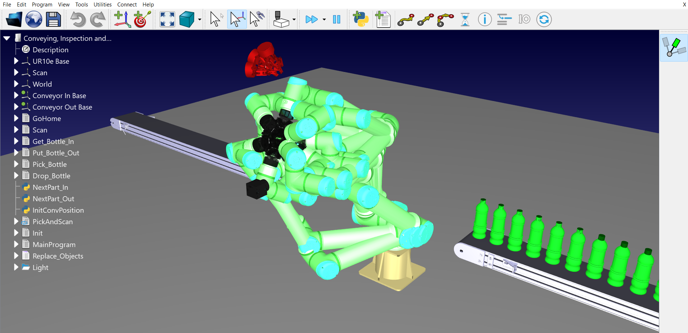
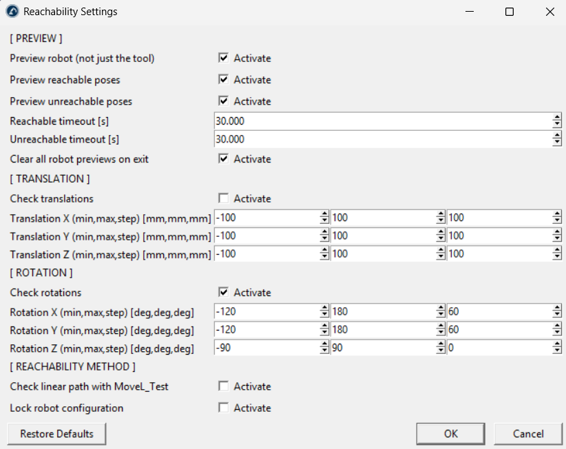

# Reachability

The Reachability Add-in for RoboDK shows which tool poses a robot can reach around its current position.

It helps you quickly check if a robot has enough room to move or rotate its tool at a specific point, before you create targets or programs.

You can access its features from the menu by going to **Utilities - Reachability** or by clicking the **Check reachability** icon in the toolbar. You can also use the **Alt+R** shortcut or right-click a robot in the station tree.

## Features

- **Reachability Preview:** Display reachable poses in green and unreachable poses in red directly in the 3D view.
- **Tool and Robot Preview:** Show only the tool, or the full robot arm, at each tested pose.
- **Rotation and Translation Ranges:** Set the minimum, maximum, and step values to test around the X, Y, and Z axes.
- **Reachability Methods:** Check poses using inverse kinematics or a linear movement test (MoveL), and optionally keep the same robot configuration.

## Usage

Move the robot to the position you want to test. Click the **Check reachability** toolbar icon and select the robot. The Add-in tests all pose combinations and shows the results in the 3D view. Uncheck the icon to clear the preview.

**Note:** Access the Reachability Settings via **Utilities - Reachability - Settings** to adjust the test ranges, preview options, and display time.
