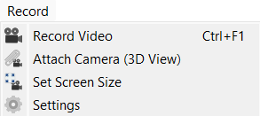

# Record

The Record Add-in for RoboDK adds cinematic recording capabilities to RoboDK.
Attach a camera to any object, and record to video file from its perspective.
You can access all its features directly from the **Record** menu in the top menu bar or via the dedicated **Record toolbar**.

- For more information about RoboDK Add-ins, visit the
[documentation](https://robodk.com/doc/en/PythonAPI/app.html).
- Submit bug reports and feature suggestions on our
[GitHub](https://github.com/RoboDK/Plug-In-Interface/issues).

## Features

- **Direct 3D Video Capture:** Record simulation motion cleanly, outputting only the 3D environment and the station tree.
- **Attach Camera (3D View):** Lock the main camera onto a moving robot joint, tool, or part to create dynamic tracking shots.
- **Standardized Aspect Ratios:** Lock dimensions to exact resolutions before recording to prevent image distortion.
- **Customizable Output Settings:** Adjust framerate (FPS) and choose between standard `.mp4` and uncompressed `.avi` video formats.
