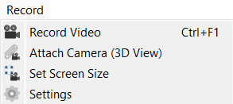
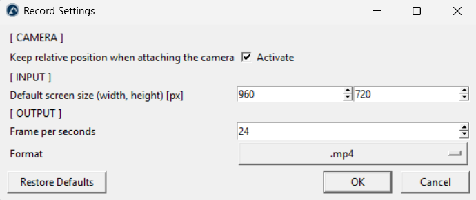

# Record

The Record Add-in for RoboDK adds video recording capabilities to RoboDK.

It lets you record your simulations as a video file, and attach the camera to any moving object to create tracking shots for presentations and demos.

You can access all its features directly from the **Record** menu in the top menu bar or via the dedicated **Record** toolbar. You can also start and stop a recording with the **Ctrl+F1** shortcut.

## Features

- **Direct 3D Video Capture:** Record the 3D view of your simulation and save it as a video file.
- **Attach Camera (3D View):** Lock the camera onto a moving robot, tool, frame, target, or object to follow it during the simulation.
- **Set Screen Size:** Set the exact size of the 3D view before recording to get a consistent video resolution.
- **Customizable Output Settings:** Adjust the frame rate (FPS) and choose between `.mp4` and `.avi` video formats.

## Usage

Click **Record Video** to start recording and run your simulation. Click it again to stop recording, then choose where to save the video file.

To follow a moving item, select it in the station tree and click **Attach Camera (3D View)**. Uncheck it to release the camera.

**Note:** Access the Record Settings via **Record - Settings** to change the video format, frame rate, default screen size, and camera behavior.
