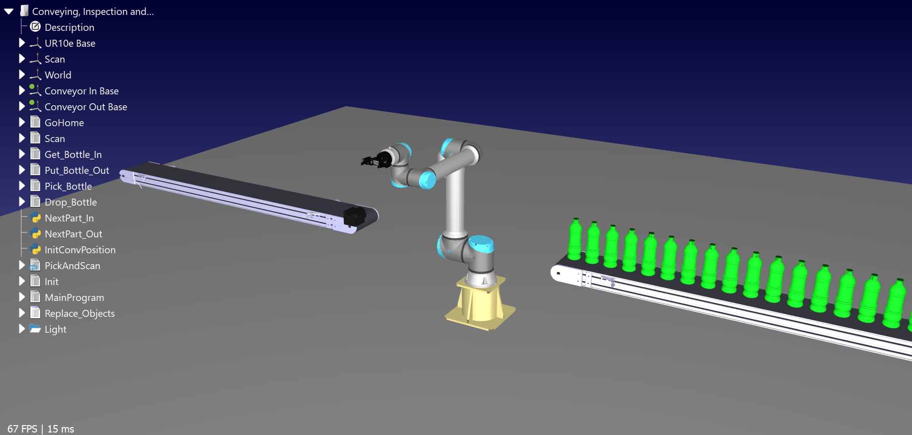
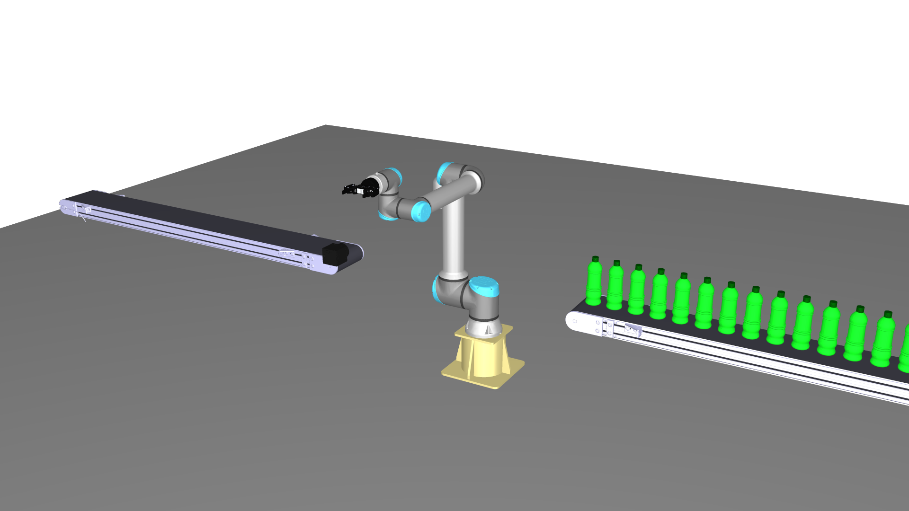
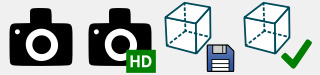
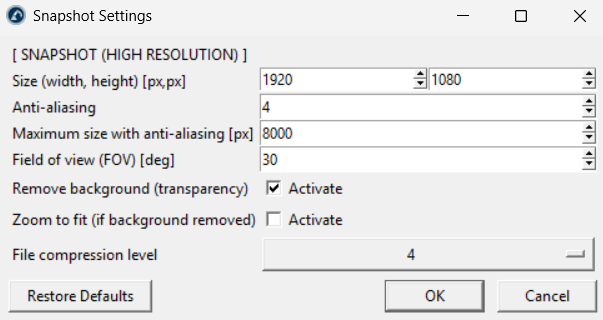

# Snapshot

The Snapshot Add-in for RoboDK adds high resolution snapshot (print screen) capabilities to RoboDK.

It lets you save images of the 3D view for documentation, presentations, and marketing material, with the option of removing the background.

You can access all its features directly from the **Snapshot** menu in the top menu bar or by clicking the **Snapshot** icons in the toolbar.

## Features

- **Quick Snapshot:** Save an image of the RoboDK window at the current screen resolution. **Note:** This also captures the station tree.
- **High Resolution Snapshot:** Save an image of the 3D view at a custom size, with anti-aliasing for smooth edges.
- **Background Removal:** Create images with a transparent background, and optionally zoom to fit the visible items.
- **Save and Load Views:** Save camera positions and load them later to take snapshots from the same point of view.

## Usage

Place the camera where you want in the 3D view, then click **Take Snapshot** or **Take Snapshot (High Resolution)**. Choose where to save the image (`.png`).

To reuse a camera position, click **Save View 1** and later **Load View 1**. Use **Save View..** and **Load View..** to store more views using an ID.

**Note:** Access the Snapshot Settings via **Snapshot - Settings** to change the image size, anti-aliasing, field of view (FOV), background removal, and file compression.
