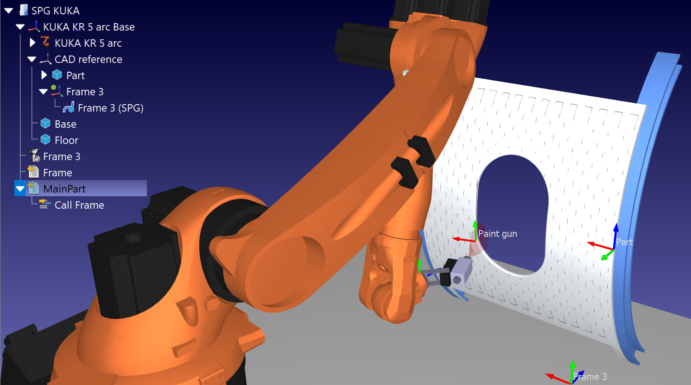
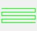

# Surface Pattern Generator

The Surface Pattern Generator (SPG) Add-in for RoboDK lets you project simple geometric patterns directly onto 3D object surfaces.

It automates path mapping for surface finishing, spray painting, welding, polishing, and area scanning by automatically linking the projected geometry to a Curve Follow Project (CFP) and generating executable robot programs.

You can access its features directly from the menu by navigating to **Utilities - Surface Pattern Generator** or by clicking the **Surface Pattern Generator** icon on the toolbar.

- For more information about RoboDK Add-ins, visit the
[documentation](https://robodk.com/doc/en/PythonAPI/app.html).
- Submit bug reports and feature suggestions on our
[GitHub](https://github.com/RoboDK/Plug-In-Interface/issues).

## Features

- **Geometric Path Projection:** Casts customizable 2D grid patterns directly onto complex 3D curved surfaces.
- **Custom Pattern Control:** Adjust boundary sizes, step resolutions, triangular tapering, and line distributions.
- **Surface Trimming:** Automatically removes path points that fall outside part boundaries or over hollow cutouts.
- **Multi-Pass Stacking:** Generate multiple layered passes with defined Z-axis offsets for additive or layered operations.
- **Automated Program Generation:** Automatically creates and solves a Curve Follow Project (CFP) with custom TCP tilt angles and operation speeds.

## Usage

Place a Frame in the station at the same level in the tree as the object and with the desired name of the CFP. Orient the frame so that the Z axis points towards the object surface, and the X and Y axis in the desired orientation.

Click the **Surface Pattern Generator** toolbar icon or select it from the **Utilities** menu, then pick your target part model. After adjusting your layout dimensions, point steps, tool inclination angles, and travel speeds in the settings dialog, click **OK**. The add-in will automatically construct the 3D projection curve, generate a linked Curve Follow Project named after your reference frame, solve the motion paths, and build the final robot program.

**Note:** Access the configuration window via **Utilities - Surface Pattern Generator - Settings** to customize pattern parameters and program outputs.
