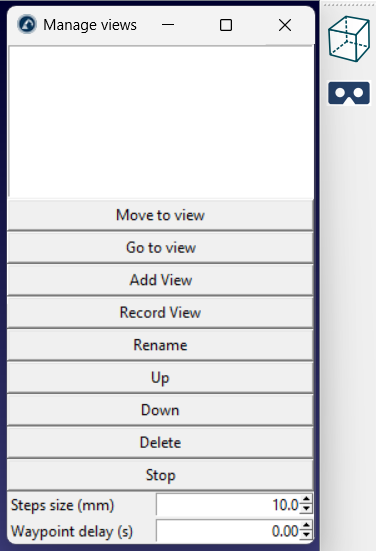
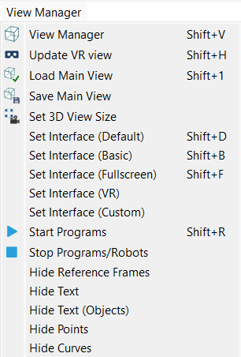

# View Manager

The View Manager Add-in for RoboDK adds 3D view and interface presets.

It can be used to set up the interface for VR, prepare the environment for video recordings, or simply save and reuse your preferred camera views.

You can access all its features directly from the **View Manager** menu in the top menu bar or by clicking the **View Manager** icon in the toolbar. You can also open the View Manager window with the **Shift+V** shortcut.

## Features

- **Named Views:** Save, rename, reorder, and delete camera views from a simple list.
- **Smooth Camera Moves:** Move the camera smoothly from one saved view to the next, with adjustable step size and delay.
- **Interface Presets:** Switch between Default, Basic, Fullscreen, VR, and your own Custom interface settings.
- **VR Support:** Send the current view to your VR headset.
- **Display Options:** Show or hide reference frames, text, points, and curves in the 3D view.
- **Program Control:** Start or stop all programs in the station with one click.

## Usage

Click the **View Manager** toolbar icon to open the list of views. Move the camera in the 3D view and click **Add View** to save it. Select a view and click **Go to view** to jump to it, or **Move to view** to move the camera smoothly. Select multiple views to move through them in order.

**Tip:** Use **View Manager - Set Interface (Custom)** to create your own interface preset.
