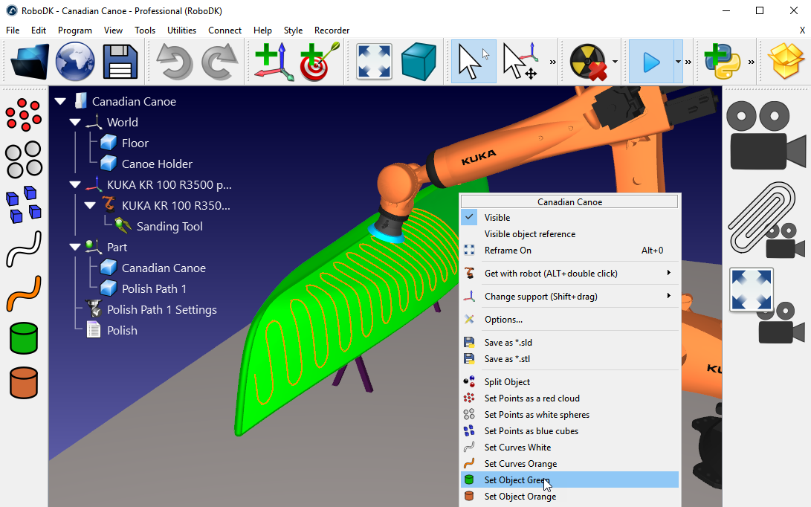
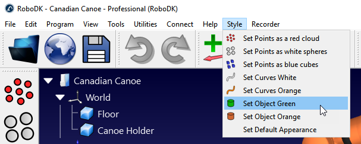
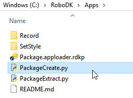

AppLoader plug-in for RoboDK
===========================

The App loader plug-in allows you to easily load scripts and executable files as if they were plug-ins in RoboDK software. 
This plugin allows integrating scripts as part of the RoboDK user interface and easily customize RoboDK for customized offline programming and simulation purposes. 
Adding scripts to an app will add buttons in the menu and the toolbar automatically. A settings file allows you to easily customize the appearance of a specific set of buttons/actions.

Once you complete developing your app you can easily distribute your app or set of apps as a package file.

The AppLoader plugin is available in RoboDK by default. However, the plugin is disabled by default. 
Follow these steps to load the AppLoader plugin:
* Select Tools->Plug-Ins
* Select Load Plug-Ins
* Select AppLoader
 

 
Each App is a subfolder inside the /RoboDK/Apps/ folder. You can add or remove apps by adding or deleting folders. You can also add or remove scripts (Python files) inside each subfolder to add or remove actions/buttons. Scripts that start with an underscore (_) are ignored and can be used as shared modules.

Each App will have its own entry in the main menu and its own toolbar. Each script inside an app will create a new button in the menu and a new button in the toolbar.

You can also use Executable files (EXE files) instead of PY files.

You can optionally provide INI files to customize integration (order of appearance, context menu option, toolbar, etc.). 
If the INI file does not exist it will be automatically generated the first time a new folder inside Apps is found.

This plugin is provided with RoboDK by default. You don't need to change it or rebuild it to create and distribute your Apps in RoboDK. This document provides general information about how apps work in RoboDK and how you can easily customize RoboDK for your specific simulation and offline programing needs using this plugin.

More information about the RoboDK API for Python here:
* https://github.com/RoboDK/RoboDK-API/tree/master/Python
* https://pypi.org/project/robodk/
* https://robodk.com/doc/en/RoboDK-API.html#PythonAPI
* https://robodk.com/doc/en/PythonAPI/robolink.html

Example
=======

The following tree shows the sample tree structure inside the Apps folder. The sample apps provided are:
* Recorder: Tools to record a video from your simulations.
* Style: Tools to change the appearance of objects and tools (change the color and appearance of surfaces, points and curves). Among other things you can change the appearance of points if you use a large point cloud.

``` bash
C:/RoboDK/
│
├───Apps
│   │
│   ├───Record
│   │       AppConfig.ini
│   │       AttachCamera.py
│   │       AttachCamera.svg
│   │       AttachCameraChecked.svg
│   │       Record.py
│   │       Record.svg
│   │       RecordChecked.svg
│   │       SetSize.py
│   │       SetSize.svg
│   │
│   ├───SetStyle
│   │      AppConfig.ini
│   │      Default_Appearance.py
│   │      Points_RedPointCloud.py
│   │      Points_RedPointCloud.svg
│   │      Points_BlueCubes.py
│   │      Points_BlueCubes.svg
│   │      Points_WhiteSpheres.py
│   │      Points_WhiteSpheres.svg
│   │      Curves_Orange.py
│   │      Curves_Orange.svg
│   │      Curves_White.py
│   │      Curves_White.svg
│   │      Surfaces_Green.py
│   │      Surfaces_Green.svg
│   │      Surfaces_Orange.py
│   │      Surfaces_Orange.svg
│   │
├───bin
...

```

The sample tree structure will create 2 menus and 2 toolbars (one for each subfolder). Each each script file in a subfolder will show as a button (action).




Package
=======

RoboDK software treats rdkp files as RoboDK packaged apps. These file consists on the Apps tree structure Zipped in one folder using the RDKP extension. 

Double clicking an rdkp file provokes RoboDK to load the AppLoader plugin automatically (for example: Package.rdkp). Furthermore, the full path of the file is passed to the apploader plugin (or the corresponding plugin) as an "OpenFile" command (PluginCommand) if the plugin name is added before the extension.

The script PackageCreate.py will pack the contents in the Apps folder and save it as Package.apploader.rdkp automatically. This file is then ready to distribute.



Icons
=====

Having an image with the same name as the script will automatically load the image as the action. Supported image types include SVG, PNG, JPG and ICO (in this order of preference).


AppConfig.ini
============

Once a new app or script is loaded for the first time, an AppConfig.ini is created. 
The AppConfig.ini file allows you to customize the priority of the App, the size of the toolbar and the size and look of each action. 

The top section (General) of the INI file allows you to customize the look. For example, the Recorder general App settings look like this:
[General]
* MenuName=Recorder - Name displayed in the main menu
* MenuPriority=999 - Lower shows first compared to other apps
* ToolbarArea=2 - Location in the toolbar, it can be: left (1), right (2), top (4), bottom (8) or default (-1)
* ToolbarSizeRatio=2 - Size of the toolbar as a ratio with respect to the default size (2 means twice the size of the default size)
* RunCommands=@Invalid() - String with commands to execute when the toolbar is loaded
* Enabled=true - Set to false to disable this app (not show it)

Each action will also have some settings to customize the appearance. For example, the Record action (script Record.py) looks like this:
[Record]
* DisplayName=Record - Name displayed in the main menu
* Description=Start/stop screen recording (3D view) - Description to display on hover
* Checkable=true - Set to true if we want this to be checkable
* CheckableGroup=1 - Set to a number greater than zero if you want to group this action with other actions having the same group index
* AddToToolbar=true - Set to false to not show this action in the toolbar
* Priority=1 - Set the priority within the same app (lower shows first)
* TypeOnContextMenu=-1 - Set to an item type to display this action when right clicking on the item (same index as the ITEM_TYPE_* in the API)
* Visible=true - Set to false to disable this action (not show it)
* Shortcut= - Set a keyboard shortcut to trigger this action


AppLink.ini
============

You can optionally create an AppLink.ini file to link the app to another folder. You should set the path to the app folder Path variable. For example, the contents of an AppLink.ini file should look like this:

``` bash
[General]
Path="D:/GitHub/Record"
```

The AppConfig.ini file (or Settings.ini in older versions) has priority over the AppLink.ini file, so the AppLink.ini file is ignored if one of the first 2 ini files are found.

 
Checkable actions
=================

When an action is checkable, the corresponding script will be executed when the action is checked and also when it is unchecked. 

A checkable action also includes the additional behavior compared to non-checkable actions:
* A station parameter with the corresponding script name (name of the script file) will be set to 1 or 0 if the action is checked or uncheck respectively.
* The argument "Checked" or "Unchecked" will be passed as argument through the process.  
* An icon can be provided for the checked state by adding the Checked keyword (as shown with the RecordChecked.svg example) 


