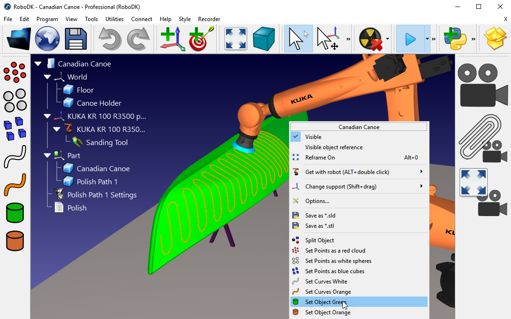

# App Loader Plug-In for RoboDK

This plugin allows integrating scripts as part of the RoboDK user interface and easily customize RoboDK for customized offline programming and simulation purposes.

The App Loader plugin was created to load classic Add-ins, and is the open source version of the Add-in Manager included with RoboDK. This plugin provides an alternative lightweight option for development compared to the Add-in manager.

Use the Add-in Manager to load, create or edit Add-ins: <https://robodk.com/doc/en/Add-ins.html#Addins>. AppLoader is kept in this repository as a real-world **example RoboDK Plug-In** — it is a good reference if you want to see a C++ plugin that builds its own dialogs, installs packages, and drives Python/executable scripts from the RoboDK UI.

If you are looking for documentation on how to *write or package a script-based Add-in* (the `.py`/`AppConfig.ini` side of things), see [Apps/README.md](./Apps/README.md) instead — that folder also contains ready-to-load example Add-ins.

## Loading the plugin

The App Loader plugin is included with RoboDK by default but is disabled:

- Select Tools -> Plug-Ins
- Select Load Plug-Ins
- Select AppLoader

Once loaded, it scans the `/RoboDK/Apps/` folder and turns every subfolder into a menu + toolbar. See [Apps/README.md](./Apps/README.md) for how those subfolders are structured.

## About RoboDK Plug-Ins (C++ development)

This section summarizes the RoboDK Plug-In Interface for C++/Qt developers. Full reference: <https://robodk.com/doc/en/PlugIns/index.html>

RoboDK Plug-Ins are Qt-based C++ libraries (DLL/SO/DYLIB) that are linked natively into RoboDK's core, rather than driven through an external API connection. This makes calls to the RoboDK API (`IRoboDK`/`IItem`) much faster than the standard Python/C#/Matlab API, and it lets a plugin customize RoboDK's UI directly (menus, toolbars, docked windows, and even the 3D OpenGL view).

Key interfaces every plugin implements or consumes (see [`robodk_interface/`](../robodk_interface/)):

- **`IAppRoboDK`** — the base class every plugin implements; it is the entry point RoboDK uses to load the plugin, add menu/toolbar actions, and forward UI events.
- **`IRoboDK`** — the native RoboDK API surface (station tree, simulation, file I/O).
- **`IItem`** — represents any object in the station tree (robot, frame, tool, program, etc). Items are pointers, not values, so always check for `nullptr`.

Things to keep in mind when writing a plugin:

- Screen updates are manual — trigger a render event explicitly after changing a robot/item's position.
- Qt signals/slots (thread-safe) are used for UI callbacks.
- Plug-Ins can only be deployed as compiled C++ libraries, and the Qt version/compiler used to build them **must match exactly** what RoboDK itself was built with:

| Platform | Qt Version | Compiler |
|----------|-----------|----------|
| Windows  | 5.15      | MSVC2019 |
| macOS    | 6.10 (>= RoboDK 6.0), 5.15 (older) | clang 64-bit |
| Linux    | 6.10 (>= RoboDK 6.0), 5.12 (older) | GCC |

Building and loading:

- Projects use **qmake**, not CMake. Double click a `.pro` file to open it in Qt Creator, or build from the command line (see the top-level [README.md](../README.md)).
- Compiled plugins are placed in `C:/RoboDK/bin/plugins/` (release, Windows) — see the top-level README for the debug/macOS/Linux paths.
- Start RoboDK with `-PLUGINSLOAD` to load all available plugins, or `-PLUGINLOAD=<path-to-plugin>` to load one on the fly, instead of using Tools -> Plug-Ins every time.
- To get started with a new plugin from scratch, copy [`PluginExample/`](../PluginExample/) rather than AppLoader — it is the minimal reference template.

## This plugin's project (AppLoader.pro)

AppLoader is a standard RoboDK plugin project (`TEMPLATE = lib`, `CONFIG += plugin`, `TARGET = AppLoader`) that includes [`robodk_interface.pri`](../robodk_interface/robodk_interface.pri) like any other plugin in this repository, plus `QT += widgets network` (per `AppLoader.pro`, to allow using `QTcpSocket`).

| File | Purpose |
|------|---------|
| `apploader.h` / `.cpp` | `IAppRoboDK` implementation: plugin entry point, menu/toolbar registration, scans `Apps/` and turns each subfolder into actions |
| `dialogapplist.h` / `.cpp` / `.ui` | Dialog window listing loaded Add-ins and their scripts |
| `applistdelegate.h` / `.cpp` | Item delegate used to render rows in the Add-in list |
| `tableheader.h` | Helper for the Add-in list's table header |
| `installerdialog.h` / `.cpp` / `.ui` | UI shown when installing an `.rdkp` Add-in package |
| `unzipper.h` / `.cpp` + `zip/` (miniz) | Unpacks `.rdkp` package files (zip archives) when installing an Add-in |

## Example Add-ins

The [`Apps/`](./Apps/) folder contains example Add-ins (Record, SetStyle, AppTemplate, etc.) that this plugin loads, and is the canonical documentation for the Add-in format (`AppConfig.ini`, `AppLink.ini`, checkable actions, packaging as `.rdkp`, etc). See [Apps/README.md](./Apps/README.md).

## Useful links

- RoboDK Plug-In interface documentation: <https://robodk.com/doc/en/PlugIns/index.html>
- Add-in Manager / packaging Add-ins as `.rdkp`: <https://robodk.com/doc/en/Add-ins.html#AddinManager>
- RoboDK API (Python): <https://robodk.com/doc/en/PythonAPI/index.html>
