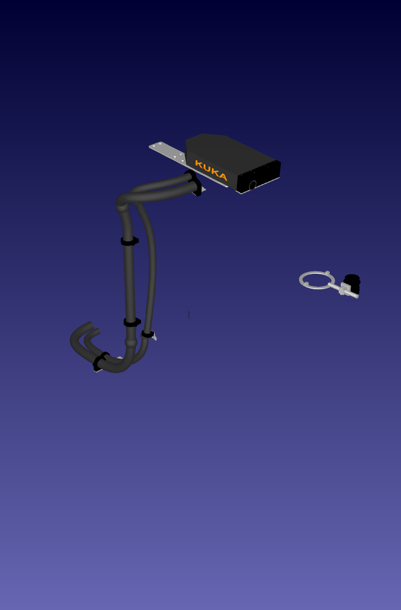
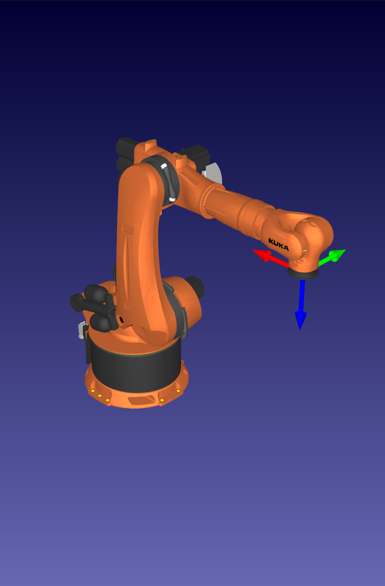
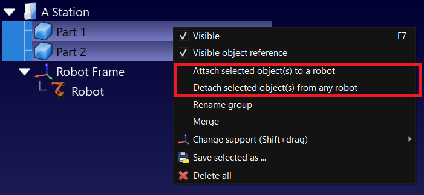
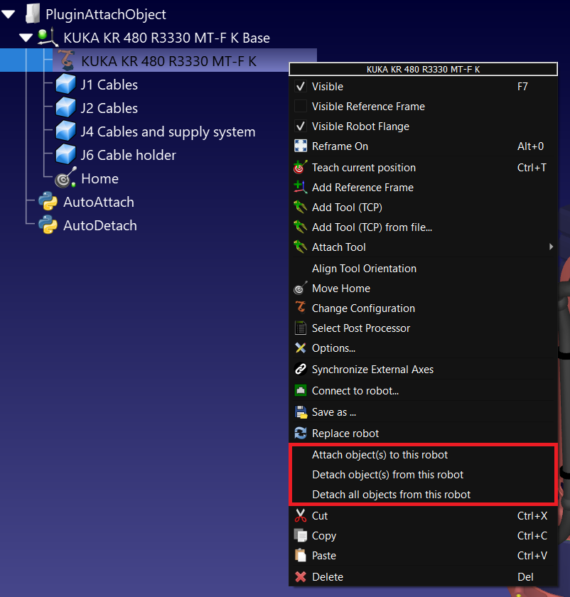
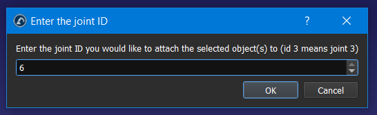

# Attach Object

The Attach Object Plug-in for RoboDK can dynamically attach multiple objects to a robot link.

## Features

- Attached objects will be updated to track the robot movements
- An object can be attached once, and a robot can have multiple objects attached to multiple links
- The user can attach and detach objects by right-clicking an object, multiple objects, or a robot

| Dress Pack (multiple objects)           | Robot                                   | Robot + Dress Pack                            |
| --------------------------------------- | --------------------------------------- | --------------------------------------------- |
|  |  |  |

## Usage

### Attaching and detaching objects from RoboDK

Attach or detach an object or multiple objects to the same robot link by right-clicking them (either in the tree or in the cell). Attach and detach menus will be present according to the state of the selected objects.
If more than one robot is present in the station, a selection prompt will appear.

Attached objects will conserve their relative position to the robot when the object is attached. Place them correctly before attaching them.



Attach or detach an object or multiple objects to the same robot link by right-clicking a robot (either in the tree or in the cell). Attach and detach menus will be present according to the state of the selected robot.
If more than one object is present in the station, a selection prompt will appear.



Once the objects an the robot are selected, a prompt will appear to select the link ID to attach. For instance, to attach an object on the last link of a six axis robot, enter 6.



### Attaching and detaching objects from the API

Here's a sample code to use this plugin through the API.

```
from robodk.robolink import *
from robodk.robodialogs import *

RDK = Robolink()

robot = RDK.ItemUserPick("Select robot", ITEM_TYPE_ROBOT)
objects = RDK.ItemList(ITEM_TYPE_OBJECT, list_names=True)

# Expected format: "Attach", "Joint|Robot|Object|". Attaches Object to Robot at Joint
#                  "Detach", "Object". Detach Object from any Robot
#                  "Detach", "Robot". Detach all Objects from Robot

dof = len(robot.Joints().list())
for obj in objects:

    entry = mbox("Robot link to attach %s?" % obj, entry=str(dof))
    if entry == False:
        continue
    link = int(entry)

    value = "%i|%s|%s" % (link, robot.Name(), obj)
    result = RDK.PluginCommand("Plugin Attach Object", "Attach", value)
    RDK.ShowMessage(value + " -> " + result, False)
```
