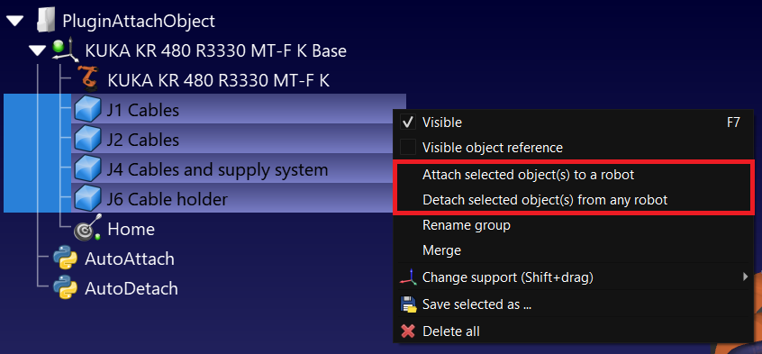

Attach object(s) to robot joint(s) Plug-in for RoboDK
===================================================

This example shows how to dynamically attach an object to a robot joint.

* Attached objects will be updated to track the robot movements. 
* An object can be attached once, and a robot can have multiple objects attached to multiple joints.
* The user can attach and detach objects by right-clicking an object, multiple objects, or a robot.

Attaching and detaching objects from RoboDK
---------------------------------------------
Attach or detach an object or multiple objects to the same robot joint by right-clicking them (either in the tree or in the cell). Attach and detach menus will be present according to the state of the selected objects.
If more than one robot is present in the station, a selection prompt will appear.

Attached objects will conserve their relative position to the robot when the object is attached. Place them correctly before attaching them.



Attach or detach an object or multiple objects to the same robot joint by right-clicking a robot (either in the tree or in the cell). Attach and detach menus will be present according to the state of the selected robot.
If more than one object is present in the station, a selection prompt will appear.


Once the objects an the robot are selected, a prompt will appear to select the joint ID to attach. For instance, to attach an object on the last joint of a six axis robot, enter 6.


Attaching and detaching objects from the API
------------------------------------------------

Here's a sample code to use this plugin through the API.

```
from robolink import *  # RoboDK API
from robodk import *  # Robot toolbox

RDK = Robolink()

robot = RDK.ItemUserPick("Select robot", ITEM_TYPE_ROBOT)
objects = RDK.ItemList(ITEM_TYPE_OBJECT, list_names=True)

# Expected format: "Attach", "Joint|Robot|Object|". Attaches Object to Robot at Joint
#                  "Detach", "Object". Detach Object from any Robot
#                  "Detach", "Robot". Detach all Objects from Robot

dof = len(robot.Joints().list())
for obj in objects:

    entry = mbox("Joint to attach %s?" % obj, entry=str(dof))
    if entry == False:
        continue
    joint = int(entry)

    value = "%i|%s|%s" % (joint, robot.Name(), obj)
    result = RDK.PluginCommand("Plugin Part Attached", "Attach", value)
    RDK.ShowMessage(value + " -> " + result, False)
```