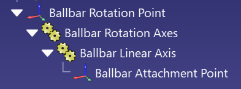
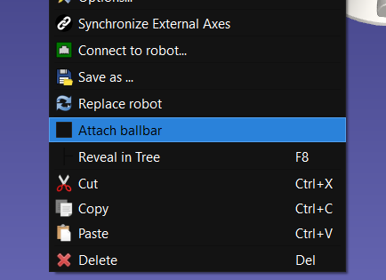

# Ballbar Tracker

The Ballbar Tracker Plug-in for RoboDK allows you to attach a ballbar to a robot.
A ballbar is fixed on it's origin and can rotate and extend to follow a TCP. 
This plug-in can be extended to simulate actuators.


## Features

- Attach/detach a ballbar to a robot from the UI and API
- Retrieve reachability status from the API


## Usage

### Ballbar mechanism

A ballbar assume the following structure:

- A parent frame corresponding to the origin of the ballbar, the rotation point.
- A two-axis mechanism for rotating the ballbar in 3D. The first joint will be use to rotate around (+/- 180 degrees), and the second up and down (+/- 90 degrees).
- A linear axis mechanism for extending and retracting the ballbar. You can set the range to 0 mm if your ballbar does not support this feature.
- A child frame corresponding to the attachment point of the ballbar.

<p align="center"></p>


### Attaching the ballbar

This plugin adds a "Attach ballbar" checkable menu item when right-clicking on a robot or a tool. When checked, the ballbar will be attached. If more than one ballbar is available, a prompt will appear to select the attachment frame of the ballbar.

<p align="center"></p>


### Using the API

Here's a sample code to use this plugin through the API.

```
from robodk.robolink import ITEM_TYPE_TOOL, Robolink

RDK = Robolink()

item = RDK.ItemUserPick("Select TCP to attach to", ITEM_TYPE_TOOL)
if not item.Valid():
    quit()

if RDK.PluginCommand("Ballbar Tracker", "Attach", item.Name()) != "OK":
    RDK.ShowMessage('Failed to attach ballbar to %s. Ensure the plugin is enabled (Shift+I)' % item.Name())
    quit()
RDK.ShowMessage('Ballbar attached to %s' % item.Name())

attached = RDK.PluginCommand("Ballbar Tracker", "Attached", item.Name()) == "1"
reachable = RDK.PluginCommand("Ballbar Tracker", "Reachable", item.Name()) == "1"

if RDK.PluginCommand("Ballbar Tracker", "Detach", item.Name()) != "OK":
    RDK.ShowMessage('Failed to detach ballbar from %s' % item.Name())
    quit()
RDK.ShowMessage('Ballbar detached from %s' % item.Name())
```


### Attaching multiple ballbars

To attach multiple ballbars to the same robot, you will have to use the API. Here's an example for a tripod configuration:

```
from robodk.robolink import ITEM_TYPE_TOOL, Robolink

RDK = Robolink()

item = RDK.ItemUserPick("Select TCP to attach to", ITEM_TYPE_TOOL)
if not item.Valid():
    quit()

if RDK.PluginCommand("Ballbar Tracker", "Attach", item.Name()) != "OK":
    RDK.ShowMessage('Failed to attach ballbar to %s. Ensure the plugin is enabled (Shift+I)' % item.Name())
    quit()
RDK.ShowMessage('Ballbar 1 attached to %s' % item.Name())

if RDK.PluginCommand("Ballbar Tracker", "Attach", item.Name()) != "OK":
    RDK.ShowMessage('Failed to attach ballbar to %s. Ensure the plugin is enabled (Shift+I)' % item.Name())
    quit()
RDK.ShowMessage('Ballbar 2 attached to %s' % item.Name())

if RDK.PluginCommand("Ballbar Tracker", "Attach", item.Name()) != "OK":
    RDK.ShowMessage('Failed to attach ballbar to %s. Ensure the plugin is enabled (Shift+I)' % item.Name())
    quit()
RDK.ShowMessage('Ballbar 3 attached to %s' % item.Name())
```


## Prerequisites
- [RoboDK](https://robodk.com/download)


## Installation

Plug-ins are usually packaged as RoboDK Packages (.rdkp), which are automatically installed when opened with RoboDK.
To manually install this Plug-in, copy the content of this folder to your RoboDK Plug-ins folder (typically `C:/RoboDK/bin/plugins`).


## Configuration

1. Enable the Plug-in (Tools->Add-ins or Shift+I)


## About RoboDK Plug-ins

The RoboDK Plug-In Interface allows you to extend or customize RoboDK software with Plug-ins linked natively into the core of RoboDK.

You can integrate your Plug-in as part of the RoboDK user interface and easily customize RoboDK for offline programming and simulation purposes.
For instance, by adding buttons in the menu and the toolbar, processing events, synchronizing with render, accept API command calls, and more.

Once you complete developing your Plug-in, you can easily distribute your Plug-in as a self-contained package file (.rdkp).

Plug-ins are handled by RoboDK with the Add-in Manager, and the [Plug-In Interface](https://github.com/RoboDK/Plug-In-Interface) provides the necessary C++ tools to build your Plug-in.

You can find more information about the Plug-In Interface and sample Plug-ins in the [Plug-In Interface GitHub](https://github.com/RoboDK/Plug-In-Interface) and the [documentation](https://robodk.com/doc/en/PlugIns/index.html).
