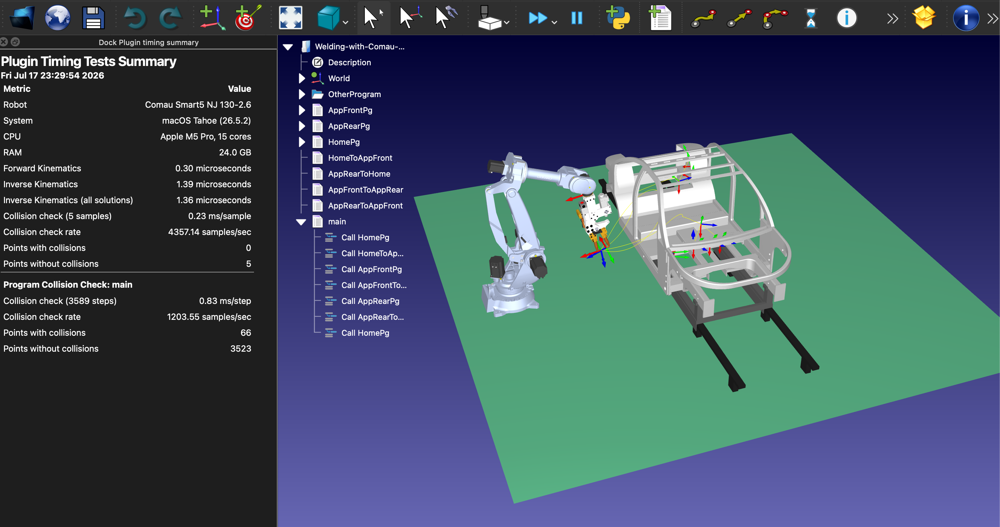

# Plugin Example

The Plugin Example is the reference RoboDK Plug-in used as a starting point for new plugins. It showcases the
Plug-in Interface: registering menu/toolbar actions, adding a docked window, listening to RoboDK events, and
calling the RoboDK API (`IRoboDK`/`IItem`) directly from C++ for maximum performance.




## Features

- **Plugin Speed Information** (`Ctrl+I`): runs a benchmark of the RoboDK API on the selected robot (Forward
  Kinematics, Inverse Kinematics, and collision checking) and reports the results in a docked window.
- **Program collision check**: optionally checks every step of a program for collisions and reports how many
  points are in collision vs. collision-free, along with timing statistics.
- Includes a **System / CPU / RAM** summary of the computer running the benchmark.
- **Robot Pilot Form**: a docked window to jog the robot by incremental steps (joints or Cartesian, relative to
  the tool or the reference frame).
- Right-click integration: the benchmark and robot pilot actions are added to the context menu of objects and
  robots in the station tree.

## Usage

1. Select **Tools-Plug-Ins** in RoboDK and load **PluginExample** if it is not already loaded.
2. Use the **Plugin Example** menu or toolbar:
   - **Plugin Speed Information** (or `Ctrl+I`): pick a robot to benchmark. You can then optionally pick a
     program to run a collision check against; if a program named `Main` exists, it is used automatically.
   - **Robot Pilot Form**: opens the jog panel described above.
   - **RoboDK Plugins - Help**: opens the RoboDK Plug-in documentation in your browser.
3. Results are shown in a docked report (HTML table) and are also printed as an aligned plain-text table in
   the console/debug output, which is useful when there is no GUI available (see below).


## Files

| File | Description |
|------|--------------|
| `pluginexample.h` / `.cpp` | Plugin entry point: `IAppRoboDK` implementation, menu/toolbar setup, benchmark logic |
| `formrobotpilot.h` / `.cpp` / `.ui` | Robot Pilot docked widget |
| `performance_tests.py` | Standalone Python script that runs the same kind of benchmarks using the RoboDK API for Python |
| `manifest.xml` | Add-in package metadata |

## Getting benchmark results from the command line

The benchmark can be triggered without any user interaction using RoboDK's `-PluginCommand` argument, which
calls `PluginCommand("BenchmarkInfo", progname)`. This is useful to collect performance stats headlessly, for
example as part of an automated test or CI run:

```bash
./RoboDK -NEWINSTANCE -NOUI -SKIPINI -PLUGINLOAD=PluginExample "./RoboDK.app/Contents/Library/Welding-with-Comau-Smart5-NJ-130-2-6.rdk" -PluginCommand=BenchmarkInfo=MainProg
```

- `-NEWINSTANCE`: starts a new RoboDK instance instead of reusing one that is already running.
- `-NOUI`: runs RoboDK without showing its main window.
- `-SKIPINI`: skips loading the user's saved settings/station list.
- `-PLUGINLOAD=PluginExample`: loads this plugin on startup.
- The quoted path is the RoboDK station (`.rdk`) to open.
- `-PluginCommand=BenchmarkInfo=MainProg`: runs the benchmark against the program named `MainProg` and prints
  the results as text to the console — since `-NOUI` means the docked report is never shown, this text output
  is the only way to read the stats in this scenario.

## Performance results

The command from the previous section was run from the command line for the [Spot welding station with Comau](https://robodk.com/example/Welding-with-Comau-Smart5-NJ-130-2-6) using RoboDK v6.0.6.

The following results can be obtained for different systems.

Note: RoboDK v6 was used which includes important performance improvements for collision checking.

### Results on Windows/PC

Using Intel Core i9-14900KF @3.19 GHz

```
Metric                                    Value
--------------------------------------------------
Robot                                     Comau Smart5 NJ 130-2.6
System                                    Windows 11 Version 2009
CPU                                       Intel(R) Core(TM) i9-14900KF, 32 cores @ 3.19 GHz
RAM                                       31.8 GB
Forward Kinematics                        0.61 microseconds
Inverse Kinematics                        2.00 microseconds
Inverse Kinematics (all solutions)        2.23 microseconds
Collision check (5 samples)               1.34 ms/sample
Collision check rate                      743.55 samples/sec
Points with collisions                    0
Points without collisions                 5

-- Program Collision Check: main --
Collision check (3589 steps)              4.57 ms/step
Collision check rate                      218.99 samples/sec
Points with collisions                    66
Points without collisions                 3523
```

### Results for Apple

### M5 Pro and Silicon build

```
Metric                                    Value
--------------------------------------------------
Robot                                     Comau Smart5 NJ 130-2.6
System                                    macOS Tahoe (26.5.2)
CPU                                       Apple M5 Pro, 15 cores
RAM                                       24.0 GB
Forward Kinematics                        0.30 microseconds
Inverse Kinematics                        1.39 microseconds
Inverse Kinematics (all solutions)        1.36 microseconds
Collision check (5 samples)               0.23 ms/sample
Collision check rate                      4357.14 samples/sec
Points with collisions                    0
Points without collisions                 5

-- Program Collision Check: main --
Collision check (3589 steps)              0.83 ms/step
Collision check rate                      1203.55 samples/sec
Points with collisions                    66
Points without collisions                 3523
```

### M1 and an Intel build

```

```