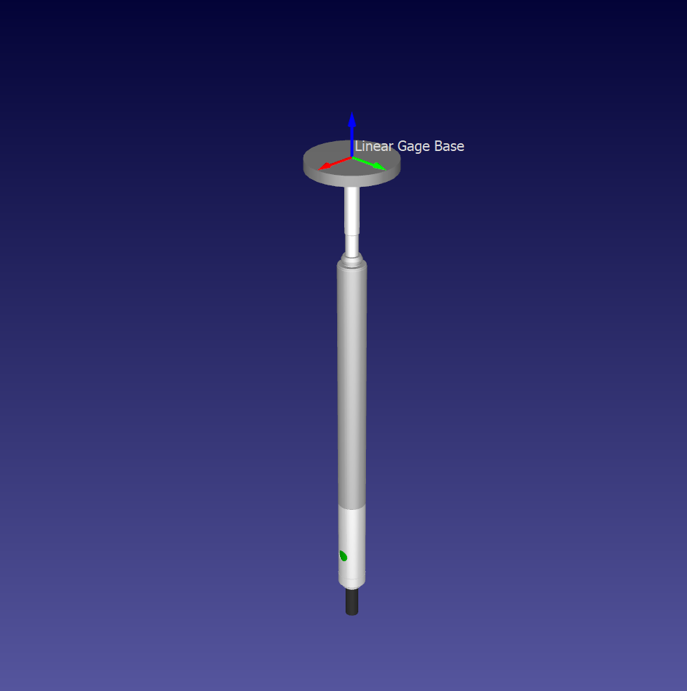

# Linear Gage Sensor (LVDT)

The Linear Gage Sensor (LVDT) Plug-in for RoboDK can dynamically move a linear gage sensor, such as an LVDT (linear variable differential transformer), according to the TCP(s) making contact.

# Features

- The linear gage must be a 1 axis mechanism, with the base frame Z axis pointing outwards.
- The linear gage limits are expected to be from 0 mm (fully extended) to >0 mm (fully engaged).
- It is assume that the gage is spring loaded, and when no TCP are within reach, will fully extend.
- The user can activate a linear gage simulation by right-clicking the Item.
  - A prompt will appear to enter the surface radius
- All TCPs will affect the gage travel, unless they are not visible.

## Prerequisites
- [RoboDK](https://robodk.com/download)

## Installation

Plug-ins are usually packaged as RoboDK Packages (.rdkp), which are automatically installed when opened with RoboDK.
To manually install this Plug-in, copy the content of this folder to your RoboDK Plug-ins folder (typically `C:/RoboDK/bin/plugins`).

## Configuration

1. Enable the Plug-in (Tools->Add-ins or Shift+I)

## About RoboDK Plug-ins

The RoboDK Plug-In Interface allows you to extend or customize RoboDK software with Plug-ins linked natively into the core of RoboDK.

You can integrate your Plug-in as part of the RoboDK user interface and easily customize RoboDK for offline programming and simulation purposes.
For instance, by adding buttons in the menu and the toolbar, processing events, synchronizing with render, accept API command calls, and more.

Once you complete developing your Plug-in, you can easily distribute your Plug-in as a self-contained package file (.rdkp).

Plug-ins are handled by RoboDK with the Add-in Manager, and the [Plug-In Interface](https://github.com/RoboDK/Plug-In-Interface) provides the necessary C++ tools to build your Plug-in.

You can find more information about the Plug-In Interface and sample Plug-ins in the [Plug-In Interface GitHub](https://github.com/RoboDK/Plug-In-Interface) and the [documentation](https://robodk.com/doc/en/PlugIns/index.html).
