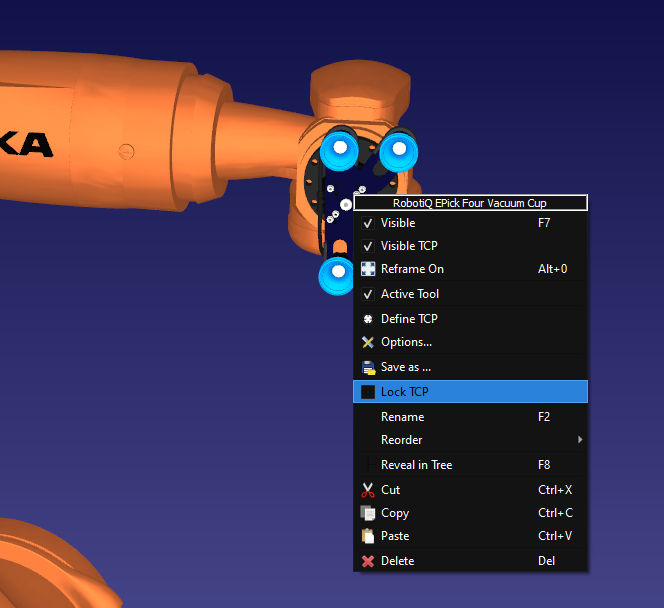
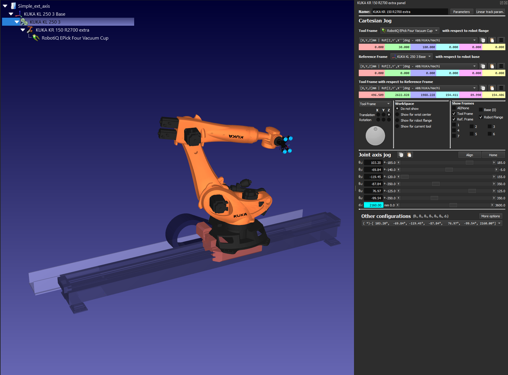
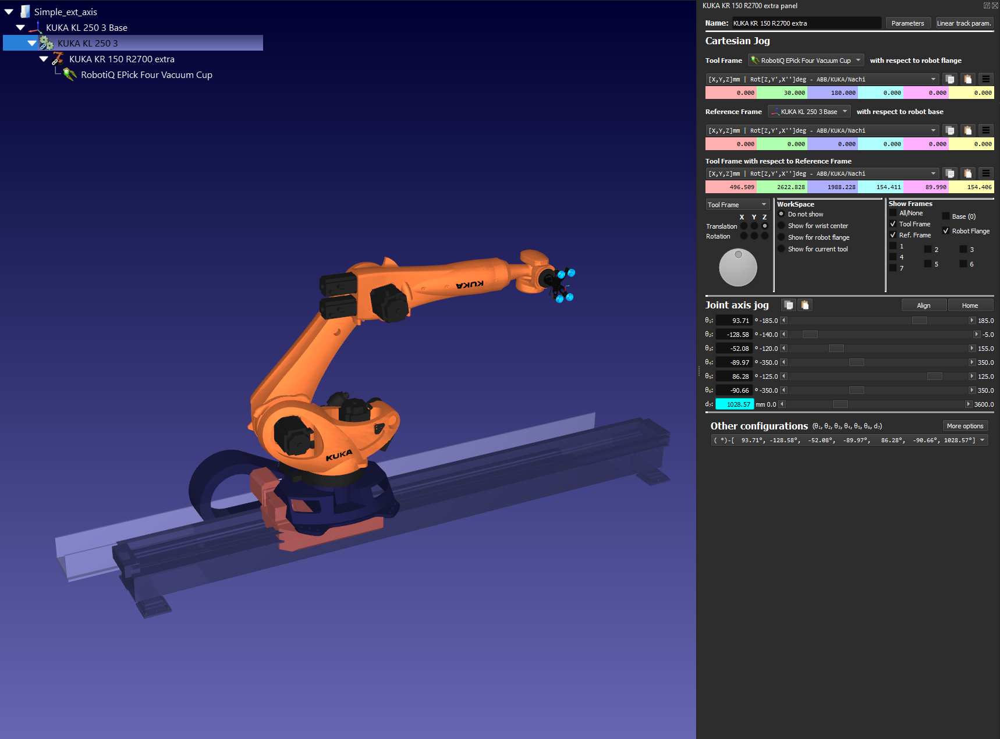

Lock TCP Plug-in for RoboDK
===========================

This example shows how to lock the TCP pose for a 6 axis robot mounted on a synchronized external axis.

This example adds a "Lock TCP" checkable menu item when right-clicking on a Tool.

Locking the TCP will allow the external axis to move the robot base while keeping the tool position.

 