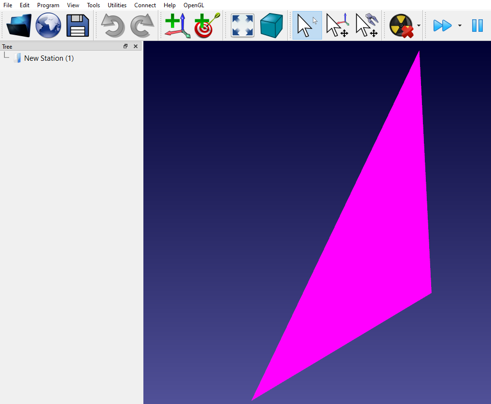

OpenGL drawing in the 3D view
===========================

This example shows how to customize the 3D view of RoboDK using RoboDK OpenGL shaders (method 2). 

There are 2 ways of drawing OpenGL with RoboDK: 

1. If you are using the default version of RoboDK (C:/RoboDK/bin/**RoboDK.exe**) you can directly use RoboDK shaders. To draw primitives such as Triangles, Lines or points you should [call RDK->DrawGeometry](https://robodk.com/doc/en/PlugIns/class_i_robo_d_k.html#a9c3ff1fccdfcb71094e8403d9f6ee3f1).
The example (PluginOpenGL-Shaders)[../PluginOpenGL-Shaders] shows how to draw OpenGL shaders using RoboDK shaders.

2. If you prefer using Desktop OpenGL (fixed pipeline without shaders), you should use the GL2 compatible binary: C:/RoboDK/bin/**RoboDK-GL2**.exe. This binary allows you to use OpenGL functions like PushMatrix(), MulMatrix(), PopMatrix(), GLBegin(), GLEnd(), etc.

Important: Make sure you select **Tools-Options-Set default settings** when you switch from RoboDK-GL2.exe and RoboDK.exe binaries.

Notes
======

* PluginEvent with event type DrawGeometry is triggered when we need to redraw the 3D videw: [pPlugin->PluginEvent](https://robodk.com/doc/en/PlugIns/class_i_app_robo_d_k.html#ab024375af071dcf8bdd7ce20672d00d0).
This function is called with the OpenGL context active.

* Use [RDK->DrawGeometry](https://robodk.com/doc/en/PlugIns/class_i_robo_d_k.html#a9c3ff1fccdfcb71094e8403d9f6ee3f1) to display primitives such as triangles, lines or points when the context is active.

* Use [RDK->Render](https://robodk.com/doc/en/PlugIns/class_i_robo_d_k.html#af0136e8bcc241db23956ae04813473de) to schedule redrawing the OpenGL scene.

It is also possible to simulate cameras with custom shaders (creating a plugin is not required):
https://robodk.com/blog/realistic-camera-simulation-shaders/

Qt Project settings
=======     

*.pro file
----------
     
The following configuration is required in the PRO file to build with support for OpenGL:
* QT += opengl
* LIBS += opengl32.lib

Run settings
-----------

You should enter the following information in the **Projects-Run settings** window:
* Executable: **C:/RoboDK/bin/RoboDK.exe**
* Arguments: **-PLUGINSUNLOAD -PLUGINLOAD=%{CurrentProject:FileBaseName}**