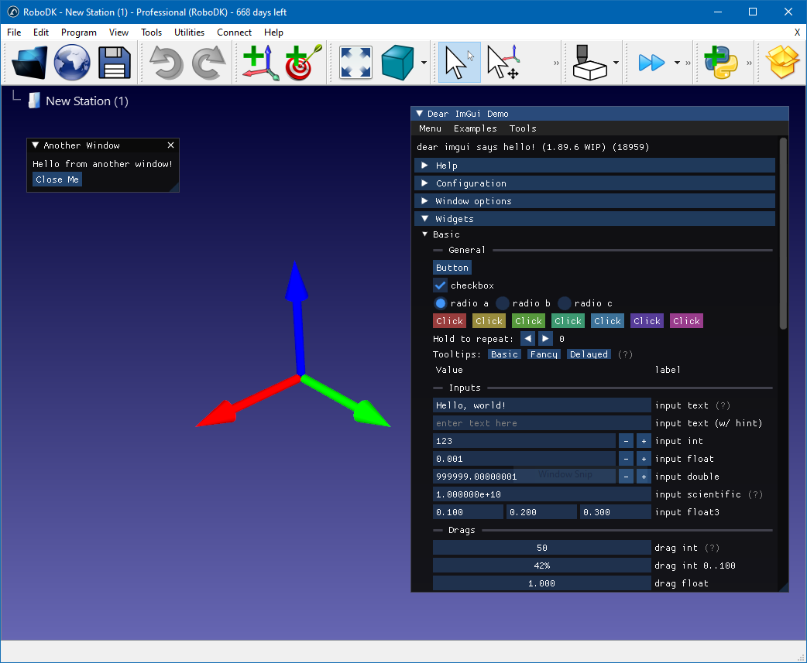

# RoboUI

This example shows the possibility of integrating a third-party library (ImGUI) to render a customized user interface in the RoboDK 3D scene window.

## Features
- Drawing a graphical user interface on top of a RoboDK 3D scene
- Determination of mouse position and the ability to switch between elements of the customized interface and the original application interface

## Prerequisites
- [RoboDK](https://robodk.com/download)

## Installation

Plug-ins are usually packaged as RoboDK Packages (.rdkp), which are automatically installed when opened with RoboDK.
To manually install this Plug-in, copy the content of this folder to your RoboDK Plug-ins folder (typically `C:/RoboDK/bin/plugins`).

## Configuration

1. Enable the Plug-in (Tools->Add-ins or Shift+I)

## About RoboDK Plug-ins

The RoboDK Plug-In Interface allows you to extend or customize RoboDK software with Plug-ins linked natively into the core of RoboDK.

You can integrate your Plug-in as part of the RoboDK user interface and easily customize RoboDK for offline programming and simulation purposes.
For instance, by adding buttons in the menu and the toolbar, processing events, synchronizing with render, accept API command calls, and more.

Once you complete developing your Plug-in, you can easily distribute your Plug-in as a self-contained package file (.rdkp).

Plug-ins are handled by RoboDK with the Add-in Manager, and the [Plug-In Interface](https://github.com/RoboDK/Plug-In-Interface) provides the necessary C++ tools to build your Plug-in.

You can find more information about the Plug-In Interface and sample Plug-ins in the [Plug-In Interface GitHub](https://github.com/RoboDK/Plug-In-Interface) and the [documentation](https://robodk.com/doc/en/PlugIns/index.html).
