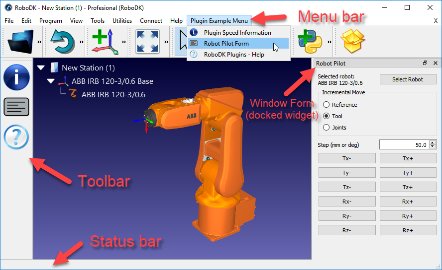
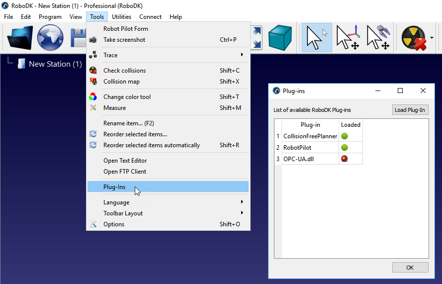
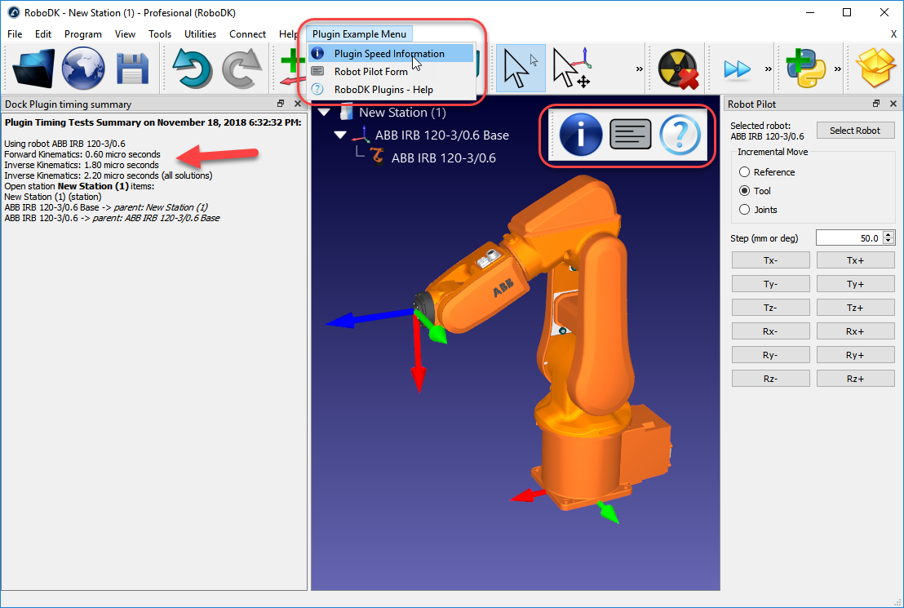

RoboDK Plug-In Interface
=========

The RoboDK Plug-In Interface allows you to extend or customize RoboDK software for industrial robots and simulation of robot arms.

RoboDK Plug-In interface documentation reference: https://robodk.com/doc/en/PlugIns/index.html

The RoboDK Plug-In interface is available in the [robodk_interface](./robodk_interface/) folder. However, it is recommended to use one of the sample projects in this repository to get started (such as the [PluginExample](./PluginExample/)).

**Important:** This Plug-In Interface and the [RoboDK API](https://github.com/RoboDK/RoboDK-API) are 2 different projects. This Plug-In Interface requires advanced programming skills in C++.

Introduction
-------------

RoboDK Plug-Ins allow extending RoboDK by using the RoboDK Interface and the RoboDK API. 
Contrary to the default RoboDK API (provided in Python, C#, C++, Matlab, etc), this RoboDK Plug-In interface is linked natively into the core of RoboDK.
Therefore, when the RoboDK API is used inside the Plugin Interface (using IItem and IRoboDK) the speed is faster than using the default API.
However, all RoboDK Plug-In applications must exist within RoboDK's environment.

Double click the .pro file in any of the sample projects to open the project with Qt Creator.
Make sure to follow the installation requirements section to install Qt as a C++ development environment.

You can load one of the sample plug-ins by selecting:
 * Tools-Plug-In
 

The default location for RoboDK plugins is C:/RoboDK/bin/plugins

Plug-In Interface vs. RoboDK API
-------------

The [RoboDK API](https://github.com/RoboDK/RoboDK-API) is a generic set of commands that allows you to interact with RoboDK and automate tasks. The RoboDK API is used by default when macros are used in RoboDK.
The RoboDK Plug-In interface includes an interface to the RoboDK API.

The main advantages of using the RoboDK API through a Plug-In Inteface are the following:
 * The RoboDK API is much faster because it is loaded as a library (a RoboDK Plug-In is actually a library loaded by RoboDK).
 * You can customize the appearance of RoboDK's main window (including the menu, toolbar, and add docked windows).

You should pay attention to the following when using the RoboDK API inside a Plug-In:
 * Items are pointers, not objects. You can check if an item is valid or not by checking if it is a null pointer (nullptr).
 * You must provoke a render event every time you want to update the screen (for example, if you change the position of a robot). Updading the screen is not done automatically.
 * Plug-Ins can only be deployed as C++ code using a DLL.

Timing tests
-------------

The PluginExample project shows how to implement a basic plugin. Among other things it performs some timing tests to calculate the speed of RoboDK on a specific computer.
By selecting the "Plugin Speed Information" button you'll obtain the timing statistics.

For example, forward and inverse kinematics are usually under 2 microseconds and 10 microseconds respectively (1 microsecond = 0.000001 seconds).

Requirements
-------------

Each RoboDK Plug-In must be developed using the Qt Creator and follow Qt's project guidelines.
It is recommended to use the \ref PluginExample project to get started with your new RoboDK Plug-In (double click PluginExample.pro to open it with Qt Creator).

RoboDK must be installed to develop Plug-Ins. The free version of RoboDK is enough to develop a Plug-In as a proof of concept.

Installation Requirements
-------------

Requirements to make RoboDK Plug-Ins work:
 * It is required to install RoboDK (v3.5.4 or later): https://robodk.com/download
 * Make sure you properly run your plugin using the following version of Qt:
  - Qt version 5.11.2 on Windows. Make sure to use Qt built for MSVC2017.
  - Qt version 5.12 on Mac.
  - Qt version 5.12 on Linux.
 * It is possible to run in \ref LinkDebug debug mode on Windows.

\image html qttoolkit.png width=800

Qt Tips
-------------

A RoboDK Plug-In must be created using the Qt Plugin Framework (C++).

This list provides some useful links and tips for programming with Qt:
 * Double click the .pro file to open the example project using Qt Creator.
 * Use Qt signal/slots mechanism for action/button callbacks (http://doc.qt.io/qt-5/signalsandslots.html). Signals and slots are thread safe.
 * Wrap your strings using tr("your string") or QObject::tr("your string") to allow translation using Qt Linguist. For more information: http://doc.qt.io/qt-5/qtlinguist-index.html.
 * If you experience strange build issues it may be useful to delete the build folder that is automatically created to force a new build.
 * If you experience strange plugin load issues in RoboDK it is recommended to delete the libraries and create the plugin library with a new build.
 * More information about Qt: https://www.qt.io/.

Useful Links
-------------

Useful links involving the RoboDK API:
 * RoboDK Plug-In interface documentation reference: https://robodk.com/doc/en/PlugIns/index.html
 * Download all samples: https://robodk.com/doc/en/PlugIns/PluginExamples.zip
 * Standard RoboDK API Introduction: https://robodk.com/doc/en/RoboDK-API.html#RoboDKAPI.
 * Standard RoboDK API Reference (based on Python): https://robodk.com/doc/en/PythonAPI/robolink.html.
 * Latest RoboDK API on GitHub (you'll find RoboDK Plugins in a subfolder): https://github.com/RoboDK/RoboDK-API.
 * RoboDK API Introductory video: https://www.youtube.com/watch?v=3I6OK1Kd2Eo.
